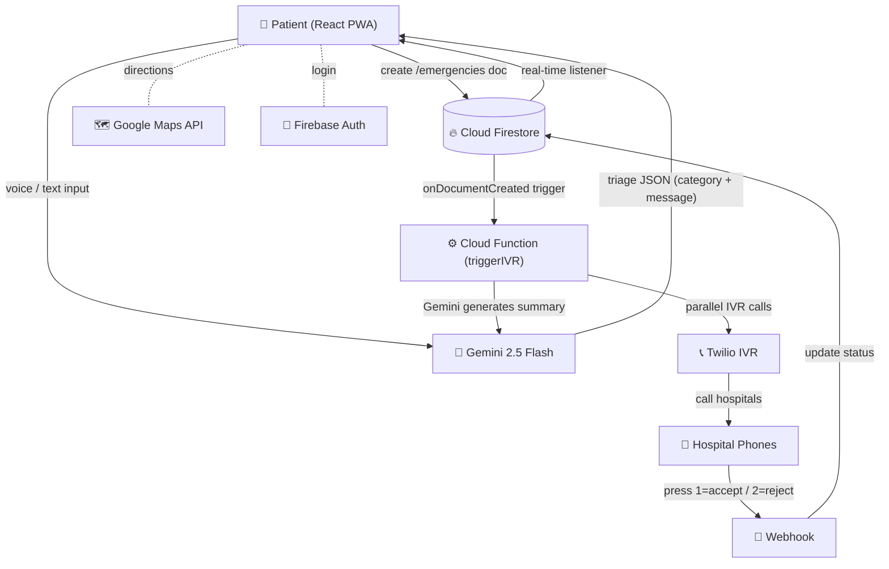

# MediConnect

Voice-first emergency medical response system — connects patients to the nearest available hospital bed in under 60 seconds through automated IVR calls.

[🔗 Live Demo]- https://medi-connect-6c1b2.web.app

---

## Architecture



---

## How It Works

The patient opens the app, hits the emergency button, and speaks or types their symptoms in Hindi or English. The raw transcript goes to Gemini, which does three things in one shot: translates it to English, classifies the emergency type (cardiac, trauma, newborn, etc.), and generates a short reassuring message back to the patient in their own language. The app then runs a geohash-based radius query on Firestore to pull nearby hospitals sorted by distance. Once the patient confirms, a Firestore document is created, which triggers a Cloud Function (`triggerIVR`). That function sends the transcript to Gemini again to generate a one-line Hindi summary, then fires Twilio IVR calls to all nearby hospitals in parallel. Each hospital hears the emergency summary and presses 1 to accept or 2 to reject. The webhook updates Firestore, the frontend picks it up via a real-time listener, and the patient sees the confirmed hospital with Google Maps directions. If Gemini is down, the system falls back to local keyword matching for classification and static Hindi descriptions for IVR — the pipeline never breaks.

---

## Why Gemini

We use Gemini for triage classification rather than rule-based keyword matching because patient symptom descriptions are unstructured and highly variable (e.g., _"seene mein bahut bhaari lag raha hai aur saans nahi aa rahi"_ vs _"severe chest pain"_) — a rule-based system would require an unmanageable list of keyword permutations across Hindi, Marathi, and English, and would still miss edge cases. Gemini's structured-output mode (`responseMimeType: "application/json"`) lets us get consistent JSON classification across this variability while still being auditable, since we constrain it to a fixed severity/specialization schema rather than free text. We also use it to generate the IVR call script — the hospital receptionist hears a natural Hindi sentence instead of a robotic keyword dump.

We picked Gemini 2.5 Flash specifically because latency matters in emergencies (Flash responds in ~800ms), and its Hindi/Marathi comprehension is solid enough for real-world rural dialects we tested with.

---

## Tech Stack

| Layer | Tech |
|---|---|
| Frontend | React 19, Vite, Tailwind CSS 4 |
| Backend | Firebase Cloud Functions (Node 20) |
| Database | Cloud Firestore (geohash indexed) |
| AI | Gemini 2.5 Flash (structured JSON output) |
| Telephony | Twilio Programmable Voice (IVR) |
| Maps | Google Maps JavaScript API |
| Auth | Firebase Authentication |

---

## Repo Structure

```
mediconnect/
├── README.md
├── docs/
│   └── architecture-diagram.png
├── src/
│   ├── pages/                     # Emergency flow (voice → hospitals → calling → results)
│   ├── screens/                   # App screens (home, login, schemes, etc.)
│   ├── hooks/                     # useEmergency, useGeolocation, useGeminiTriage
│   ├── components/                # HospitalCard, Navigation, ProfileDrawer
│   ├── context/                   # AppContext (shared state across screens)
│   ├── firebase/                  # Firestore helper functions
│   └── services/                  # IVR service layer
├── functions/
│   └── src/
│       ├── triggerIVR.js          # geohash query + Gemini summary + Twilio calls
│       ├── twilioWebhook.js       # hospital keypress handler (1=accept, 2=reject)
│       └── sendFCM.js             # push notification to patient
├── firestore.rules
├── .env.example
└── firebase.json
```

---

## Setup

```bash
git clone https://github.com/your-username/medi-connect.git
cd medi-connect
npm install
cd functions && npm install && cd ..
```

Copy `.env.example` → `.env.local` and fill in:
- Firebase config (from Firebase Console → Project Settings)
- `VITE_GEMINI_API_KEY` from [Google AI Studio](https://aistudio.google.com/apikey)
- `VITE_GOOGLE_MAPS_API_KEY` from Google Cloud Console
- Twilio creds go in `functions/.env`

```bash
npm run dev          # runs at localhost:5173
firebase deploy      # deploy everything
```

---

## Limitations

- Web Speech API needs Chrome + internet (no offline speech-to-text)
- Gemini free tier caps at ~10-15 RPM — handled with fallback but not production-ready
- Twilio IVR costs per call — needs budget planning for scale
- Hospital data is manually seeded, no live govt API integration yet

---

## License

MIT
